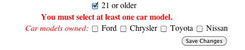

# Form Validation Using XML
{:.no_toc}

* Will be replaced with the ToC, excluding a header
{:toc}

The example code for this tutorial, **form-xml-validation**, is available for checkout at [struts-examples](https://github.com/apache/struts-examples)

## Introduction

In this tutorial we'll cover how to validate a user's input in form fields using Struts's XML validation methodology.
In the [Form Validation](form-validation) tutorial we discussed validating a user's input using the validate method 
in the Action class. Using a separate XML validation file gives you the ability to use validators built-in 
to the Struts framework.

The [Struts user mailing list](http://struts.apache.org/mail) is an excellent place to get help. If you are having 
a problem getting the tutorial example applications to work search the Struts mailing list. If you don't find an answer 
to your problem, post a question on the mailing list.

## Example Application

The example application that supports this tutorial shows how to use Struts's XML validation methodology. 
The information that can be edited is encapsulated in an object of class Person.

To enable the user to edit his information that is stored in the Person object, we have this form:


When the user submits the form, we want to validate his entries into the form fields.

## Validation Using XML

To validate a user's form field entries you can use a separate XML file that contains your validation rules.
The XML file that contains the validation rules must be named as ActionClassName-validation.xml. In the example 
application, the XML validation file is named EditAction-validation.xml (see src/main/resources/org/apache/struts/edit/action).

> **Note:** When using action names with slashes (enabled via `struts.enable.SlashesInActionNames`), validation file naming follows a special rule where slashes are replaced with hyphens. See [Validation Files for Actions with Slashes](../core-developers/validation#validation-files-for-actions-with-slashes) for detailed information.

Struts provides several different validators that you can use in the XML validation file. See [Validation](../core-developers/validation) 
for a list of validators you can employ.

In the above form, we want to ensure the user enters a first name. To have the Struts framework enforce that rule 
we can use the Struts [requiredstring validator](../core-developers/requiredstring-validator). This validator checks 
that the user has entered a string value in the form field.

## XML Validator Format

In the XML validation file (for this example that is `EditAction-validation.xml`), is this XML:

**XML Validator Required String**

```xml
<?xml version="1.0"?>
<!DOCTYPE validators PUBLIC
        "-//Apache Struts//XWork Validator 1.0.3//EN"
        "https://struts.apache.org/dtds/xwork-validator-1.0.3.dtd">
<validators>
    <validator type="requiredstring">
        <param name="fieldname">personBean.firstName</param>
        <message>First name is required.</message>
    </validator>
</validators>
```

Within the validators node you can have 1 or more validator nodes. The type attribute specifies which validator you 
want the Struts framework to use (see [Validation](../core-developers/validation) ). The param name="fieldname" node 
is used to tell the framework which form field entry to apply the rule to. See edit.jsp for the form fields and their 
name value (review [Struts Form Tags](form-tags) if you're not familiar with how to use Struts form tags). T
he message node is used to tell the framework what message to display if the validation fails.

| There are alternate ways to write the XML that goes in the validation XML file. See [Validation](../core-developers/validation) 
in the Struts documentation for a full discussion.

For example if the user doesn't enter a value in the first name form field and clicks on the Save Changes button, h
e will see the following.


## Validating An Email Address

You can use the Struts [email validator](../core-developers/email-validator) to validate the user's input in the email 
field. Here is the validator node that is in the `EditAction-validation.xml` file.

**Email Validator**

```xml
<validator type="requiredstring">
    <param name="fieldname">personBean.email</param>
    <message>Email address is required.</message>
</validator>
<validator type="email">
    <param name="fieldname">personBean.email</param>
    <message>Email address not valid.</message>
</validator>
```

Note that in the example, we are requiring the user to enter an email address and then validating the email address the user entered.

## Validating A User's Input Using A Regular Expression

The Struts framework provides a powerful way to validate a user's form field input by using the [regex validator](../core-developers/regex-validator).
In the example application, we want to ensure the user enters the phone number in the format 999-999-9999. We can use
a regular expression and the [regex validator](../core-developers/regex-validator) to enforce this rule.

**REGEX Validator**

```xml
<validator type="requiredstring">
    <param name="fieldname">personBean.phoneNumber</param>
    <message>Phone number is required.</message>
</validator>
<validator type="regex">
    <param name="fieldname">personBean.phoneNumber</param>
    <param name="regex"><![CDATA[\d{3}-\d{3}-\d{4}]]></param>
    <message>Phone number must be entered as 999-999-9999.</message>
</validator>
```

The `param name="regex"` node is used to specify the regular expression that will be applied to the user's input. 
Note how the regular expression is contained within a CDATA section.

## Validating A User's Input Using An OGNL Expression

In the example application, we want to ensure the user checks at least one of the car model check boxes. To enforce 
this rule we can use the [fieldexpression validator](../core-developers/fieldexpression-validator). 
Here's the XML for that validator node.

**FieldExpression Validator**

```xml
<validator type="fieldexpression">
    <param name="fieldname">personBean.carModels</param>
    <param name="expression"><![CDATA[personBean.carModels.length > 0]]></param>
    <message>You must select at least one car model.</message>
</validator>
```

The param name="expression" node contains an OGNL expression that evaluates to true or false. We haven't previously 
discussed OGNL, which stands for Object-Graph Navigation Language (see [https://github.com/jkuhnert/ognl](https://github.com/jkuhnert/ognl) 
and [OGNL](../tag-developers/ognl) ). OGNL expressions can be evaluated by the Struts framework as Java statements.

In the above XML the value of the param name="expression" node, personBean.carModels.length > 0, will be evaluated 
by the framework as a Java statement. The part personBean.carModels tells the framework to call the getCarModels 
method of class Person. That method returns an Array. Since class Array has a length attribute, the framework will get 
the value of the length attribute of the Array returned by the getCarModels method.

If the user did not check any of the check boxes, the Array returned by the getCarModels method will have a length 
value of 0. Since the complete OGNL expression will only evaluate to true if the length value is greater than 0, 
the validation fails. The user will see this.



The fieldexpression validator is useful when doing conditional validation of a user's input. If the OGNL expression 
doesn't evaluate to true then the user's input won't be allowed.

## Summary

The Struts framework provides easy-to-use validation methodologies. You can add a validate method to the Action class 
or have a separate XML file with validation rules or you can use a combination of both methodologies.

|Return to [Form tags](form-tags)|or|onward to [Control tags](control-tags)|
