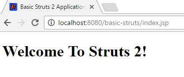

# How To Create A Struts 2 Web Application
{:.no_toc}

* Will be replaced with the ToC, excluding a header
{:toc}

This tutorial walks through installing the framework and creating a simple application.

While the Struts 2 framework is simple to use, creating non-trivial applications assumes a working knowledge 
of many J2EE technologies, including:

 - Java
 - Filters, JSP, and Tag Libraries
 - JavaBeans
 - HTML and HTTP
 - Web Containers (such as Tomcat)
 - XML

> For more about supporting technologies, see the [Key Technologies Primer](../primer.html). 

## Java Requirements

Struts 2 requires Servlet API 2.4 or higher, JSP 2.0 or higher, and Java 7 or higher.

## Our First Application

To get started using Struts 2 we will create a web application using Maven to manage the artifact dependencies.
You can checkout all the example applications from the Struts 2 GitHub repository 
at [struts-examples](https://github.com/apache/struts-examples).

## Create Struts 2 Web Application Using Maven To Manage Artifacts and To Build The Application

> This tutorial assumes you know how to create a Java web application that uses Maven to manage artifacts and build 
the web application archive (war) file.

### Step 1 - Create A Java Web Application

In your Java IDE create a Java web application with a project name of `basic_struts` that follows the standard Maven
project folder structure. In your `pom.xml` include the following:

**pom.xml build node**

```xml
<build>
    <finalName>basic-struts</finalName>
</build>
```

##### to run the application using maven, add the jetty maven-plugin to your pom.xml

**pom.xml jetty plugin**

```xml
<build>
    ...   
    <plugins>
        <plugin>
            <groupId>org.eclipse.jetty</groupId>
            <artifactId>jetty-maven-plugin</artifactId>
            <version>9.4.7.v20170914</version>
            <configuration>
                <webApp>
                    <contextPath>/${build.finalName}</contextPath>
                </webApp>
                <stopKey>CTRL+C</stopKey>
                <stopPort>8999</stopPort>
                <scanIntervalSeconds>10</scanIntervalSeconds>
                <scanTargets>
                    <scanTarget>src/main/webapp/WEB-INF/web.xml</scanTarget>
                </scanTargets>
            </configuration>
        </plugin>
    </plugins>
</build>
```
The above plugin will enable you to run the application using `mvn jetty:run`

### Step 2 - Add index.jsp

Our next step is to add a simple `index.jsp` to this web application. Create an `index.jsp` under `src/main/webapp`
with a title of __Basic Struts 2 Application - Welcome__ and in the body add an h1 heading of __Welcome to Struts 2!__

**index.jsp**

```jsp
<!DOCTYPE html>
<%@ page language="java" contentType="text/html; charset=UTF-8" pageEncoding="UTF-8" %>
<html>
  <head>
    <meta charset="UTF-8">
    <title>Basic Struts 2 Application - Welcome</title>
  </head>
  <body>
    <h1>Welcome To Struts 2!</h1>
  </body>
</html>
```

Run `mvn jetty:run` to run the application.

In a web browser go to [http://localhost:8080/basic-struts/index.jsp](http://localhost:8080/basic-struts/index.jsp).
You should see the following:



### Step 3 - Add Struts 2 Jar Files To Class Path

Now that we know we have a working Java web application, let's add the minimal required Struts 2 framework Jar files 
to our web application's class path. In `pom.xml` add the following dependency node:

**pom.xml dependency node**

```xml
<dependency>
    <groupId>org.apache.struts</groupId>
    <artifactId>struts2-core</artifactId>
    <version>${struts2.version}</version>
</dependency>
```

Of course replace the `${struts2.version}` with the current Struts 2 version (or define within pom `properties`). 
Maven will get the `struts2-core` jar and the other jar 
files struts2-core requires (transitive dependencies). 

<i class="glyphicon glyphicon-info-sign alert-info" aria-hidden="true"></i> Beginning with Struts version 2.2.3 
you do not need to specify a separate dependency node for javassist.

### Step 4 - Add Logging

To see what's happening under the hood, the example application for this tutorial uses log4j2. You'll need to add a dependency node for log4j2 to the pom:

**pom.xml log4j dependency node**

```xml
<dependency>
    <groupId>org.apache.logging.log4j</groupId>
    <artifactId>log4j-core</artifactId>
    <version>${log4j2.version}</version>
</dependency>
<dependency>
    <groupId>org.apache.logging.log4j</groupId>
    <artifactId>log4j-api</artifactId>
    <version>${log4j2.version}</version>
</dependency>
```

Using both `log4j-core` and `log4j-api` allows to use [the latest version of Log4j2](//logging.apache.org/log4j/2.x/maven-artifacts.html) without a clash with version provided by the framework. Setup a `log4j2.xml` configuration in the `src/main/resources` folder which contains the following

**log4j2.xml**

```xml
<?xml version="1.0" encoding="UTF-8"?>
<Configuration>
    <Appenders>
        <Console name="STDOUT" target="SYSTEM_OUT">
            <PatternLayout pattern="%d %-5p [%t] %C{2} (%F:%L) - %m%n"/>
        </Console>
    </Appenders>
    <Loggers>
        <Logger name="com.opensymphony.xwork2" level="debug"/>
        <Logger name="org.apache.struts2" level="debug"/>
        <Root level="warn">
            <AppenderRef ref="STDOUT"/>
        </Root>
    </Loggers>
</Configuration>
```

Note the above log4j2 configuration specifies the console as the log target.

Optionally, if using maven bom "bill of materials" in `dependencyManagement` section for both Struts and log2j 2,
`pom.xml` will look like. Note that this way you can omit `version` line for every used module

```xml
<properties>
	<project.build.sourceEncoding>UTF-8</project.build.sourceEncoding>
	<project.reporting.outputEncoding>UTF-8</project.reporting.outputEncoding>
	<java.version>1.8</java.version>

	<struts2.version>2.5.14</struts2.version>
	<log4j2.version>2.10.0</log4j2.version>
</properties>

<dependencyManagement>
	<dependencies>
		<dependency>
			<groupId>org.apache.struts</groupId>
			<artifactId>struts2-bom</artifactId>
			<version>${struts2.version}</version>
			<type>pom</type>
			<scope>import</scope>
		</dependency>
		<dependency>
			<groupId>org.apache.logging.log4j</groupId>
			<artifactId>log4j-bom</artifactId>
			<version>${log4j2.version}</version>
			<scope>import</scope>
			<type>pom</type>
		</dependency>
	</dependencies>
</dependencyManagement>

<dependencies>
	<!-- Struts 2 -->
	<dependency>
		<groupId>org.apache.struts</groupId>
		<artifactId>struts2-core</artifactId>
	</dependency>

	<dependency>
		<groupId>org.apache.logging.log4j</groupId>
		<artifactId>log4j-core</artifactId>
	</dependency>
</dependencies>
```

### Step 5 - Add Struts 2 Servlet Filter

To enable the Struts 2 framework to work with your web application you need to add a Servlet filter class and filter 
mapping to `web.xml`. Below is how the `web.xml` may look after adding the filter and filter-mapping nodes. `web.xml` is to be under `src/main/webapp/WEB-INF` folder.

**web.xml Servlet Filter**

```xml
<?xml version="1.0" encoding="UTF-8"?>
<web-app id="WebApp_ID" version="2.4"
	xmlns="http://java.sun.com/xml/ns/j2ee" 
	xmlns:xsi="http://www.w3.org/2001/XMLSchema-instance"
	xsi:schemaLocation="http://java.sun.com/xml/ns/j2ee http://java.sun.com/xml/ns/j2ee/web-app_2_4.xsd">
	<display-name>Basic Struts2</display-name>
	<welcome-file-list>
		<welcome-file>index</welcome-file>
	</welcome-file-list>

	<filter>
		<filter-name>struts2</filter-name>
		<filter-class>org.apache.struts2.dispatcher.filter.StrutsPrepareAndExecuteFilter</filter-class>
	</filter>

	<filter-mapping>
		<filter-name>struts2</filter-name>
		<url-pattern>/*</url-pattern>
	</filter-mapping>

</web-app>
```

For more information about configuring the deployment descriptor for Struts 2 see [Core Developers Guide / web.xml page](/core-developers/web-xml.html). Note the url-pattern node 
value is `/*` meaning the Struts 2 filter will be applied to all URLs for this web application.

### Step 6 - Create struts.xml

Struts 2 can use either an XML configuration file or annotations (or both) to specify the relationship between a URL, 
a Java class, and a view page (such as `index.jsp`). For our basic Struts 2 application, we'll use a minimal xml 
configuration. Note the file name is `struts.xml` and it should be in the `src/main/resources` folder (`struts.xml` 
must be on the web application's root class path).

**struts.xml**

```xml
<?xml version="1.0" encoding="UTF-8"?>
<!DOCTYPE struts PUBLIC
    "-//Apache Software Foundation//DTD Struts Configuration 2.5//EN"
    "http://struts.apache.org/dtds/struts-2.5.dtd">

<struts>

    <constant name="struts.devMode" value="true" />

    <package name="basicstruts2" extends="struts-default">
        <action name="index">
            <result>/index.jsp</result>
        </action>
    </package>

</struts>
```

This minimal Struts 2 configuration file tells the framework that if the URL ends in `index.action` to redirect 
the browser to `index.jsp`.

For more information about the struts.xml configuration file see `struts.xml`.

### Step 7 - Build and Run the Application

Run `mvn jetty:run` to run the web-application using the jetty maven-plugin.

View the console where you should see numerous debug messages that tell you the Struts 2 framework is being included in the `basic-struts2` web application.

Open a web browser and go to [http://localhost:8080/basic-struts/index.action](http://localhost:8080/basic-struts/index.action) 
(note that's `index.action` not `index.jsp` at the end of the URL). You should see the same web page as when going to 
[http://localhost:8080/basic-struts/index.jsp](http://localhost:8080/basic-struts/index.jsp). View the log 
messages written to the console and you should find several that discuss `index.action` and `index.jsp`:

**Struts 2 Log Messages**

```
...
2017-04-17 11:16:01,084 DEBUG [qtp1723848804-22] xwork2.DefaultActionProxy (DefaultActionProxy.java:89) - Creating an DefaultActionProxy for namespace [/] and action name [index]
...
2017-04-17 11:16:01,172 DEBUG [qtp1723848804-22] result.ServletDispatcherResult (ServletDispatcherResult.java:131) - Forwarding to location: /index.jsp
...
```

## Getting Help

The [Struts 2 user mailing list](/mail.html) is an excellent place to get help.  If you are having a problem getting 
this Basic Struts 2 application to work search the Struts 2 mailing list. If you don't find an answer to your problem, 
post a question on the mailing list.  

|Return to [Getting started](index.html)|or|onward to [Hello World using Struts 2](hello-world-using-struts2.html)|
