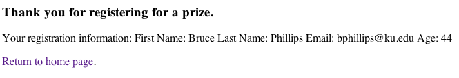

# Processing Forms
{:.no_toc}

* Will be replaced with the ToC, excluding a header
{:toc}

This tutorial assumes you've completed the [Coding Struts 2 Actions](coding-actions.html) tutorial and have a working 
coding-actions project. The example code for this tutorial, form-processing, is available for checkout from 
the Struts 2 GitHub subversion repository: [https://github.com/apache/struts-examples](https://github.com/apache/struts-examples).

## Introduction

In this tutorial we'll explore using Struts 2 to do more involved processing of a form submission. We'll cover how to 
use a Java model class to store the form input and how to create the Struts 2 form to match up with that model class.

The code provided in this tutorial may be added to the [Coding Struts 2 Actions](coding-actions.html) example or you 
can download this complete example from the github respository - [https://github.com/apache/struts-examples](https://github.com/apache/struts-examples).

The [Struts 2 user mailing list](http://struts.apache.org/mail.html) is an excellent place to get help. If you are 
having a problem getting the tutorial example applications to work search the Struts 2 mailing list. If you don't find 
an answer to your problem, post a question on the mailing list.

## Forms and a Java model class

For this tutorial let's say we need to provide a form that a user may submit to register for a prize drawing. Our 
business rules state the user must provide his/her first name, last name, email address, and age.

To encapsulate this data, we'll use a simple Java class that follows the basic Java Bean specifications (public set/get 
methods for each instance field). If you're following along add this class to the package `org.apache.struts.register.model` 
in the [Coding Struts 2 Actions](coding-actions.html) example.

**Person.java**

```java
public class Person {
    private String firstName;
    private String lastName;
    private String email;
    private int age;

    public String getFirstName() {
        return firstName;
    }

    public void setFirstName(String firstName) {
        this.firstName = firstName;
    }

    public String getLastName() {
        return lastName;
    }

    public void setLastName(String lastName) {
        this.lastName = lastName;
    }

    public String getEmail() {
        return email;
    }

    public void setEmail(String email) {
        this.email = email;
    }

    public int getAge() {
        return age;
    }

    public void setAge(int age) {
        this.age = age;
    }

    public String toString() {
        return "First Name: " + getFirstName() + " Last Name:  " + getLastName() + 
        " Email:      " + getEmail() + " Age:      " + getAge() ;
    }
}
```

Note a few points about the above class. There is a public set/get method for each instance field. The age attribute 
is of type integer. We've defined a public `toString` method that returns a String representing the state of the object. 
Since we haven't specified a constructor, Java will provide a default constructor that will set all instance fields to 
their null values.

## Form structure

To collect the above information we'll use a Struts 2 form. When creating this form the key concept we need to employ 
is to tie each form field to a specific instance field of an object of type Person. Let's look over the form first and 
then discuss some key points. Create a view page named `register.jsp` (in `src/main/webapp`)

**register.jsp**

```jsp
<%@ taglib prefix="s" uri="/struts-tags" %>
<%@ page language="java" contentType="text/html; charset=UTF-8" pageEncoding="UTF-8"%>
<!DOCTYPE html>
<html>
  <head>
    <meta http-equiv="Content-Type" content="text/html; charset=UTF-8" />
    <title>Register</title>
  </head>
  <body>
    <h3>Register for a prize by completing this form.</h3>

    <s:form action="register">
      <s:textfield name="personBean.firstName" label="First name" />
      <s:textfield name="personBean.lastName" label="Last name" />
      <s:textfield name="personBean.email"  label ="Email"/>  
      <s:textfield name="personBean.age"  label="Age"  />
      <s:submit/>
    </s:form>	
  </body>
</html>
```

Since we are using Struts 2 tags, at the top of the page we need the Struts tag library declaration.

The Struts 2 form will submit to an action named register. We'll need to define that action in our `struts.xml` file.

Note the four Struts 2 textfield tags. Each tag has a name value that includes an attribute of the `Person` class 
(e.g. `firstName`). The name attribute's value also has a reference to an object called `personBean`. This object is 
of type `Person`. When we create the Action class that handles this form submission, we'll have to specify that object 
in that Action class (see below).

The complete name value, `personBean.firstName`, instructs Struts 2 to use the input value for that textfield as 
the argument to the personBean object's `setFirstName` method. So if the user types "Bruce" in the textfield that has 
the label "First name", the personBean's `firstName` instance field will have a value of "Bruce".

Note that we have a Struts 2 textfield for each instance field of the class Person. Remember that Person class's age 
attribute is of type integer. All form field input values are Strings. Struts 2 will automatically convert the String 
value ("25") the user entered for the age form field to 25 when calling the `setAge` method of object `personBean`.

## Creating the Action class to handle the form submission

When the user clicks on the submit button of the above form, the action "register" and the form data will be sent to 
the Struts 2 framework. We need an Action class to process this form. If you recall from the tutorial 
[Coding Struts 2 Actions](coding-actions.html) our Action class should extend the Struts 2 ActionSupport class.

Here is the Action class used for this example. Place it in package org.apache.struts.register.action.

**Register.java Struts 2 Action Class**

```java
package org.apache.struts.register.action;

import com.opensymphony.xwork2.ActionSupport;
import org.apache.struts.register.model.Person;

public class Register extends ActionSupport {
    
    private static final long serialVersionUID = 1L;
    
    private Person personBean;


    public String execute() throws Exception {
        //call Service class to store personBean's state in database
        
        return SUCCESS;
    }
    
    public Person getPersonBean() {
        return personBean;
    }
    
    public void setPersonBean(Person person) {
        personBean = person;
    }

}
```

In the `Register` class note that we've declared an attribute named `personBean` of type `Person` and there is a public 
get and set method for this object.

The `Register` class also overrides the `execute` method. The `execute` method is the one we will specify in the 
`struts.xml` to be called in response to the register action. In this example, the `execute` method just returns 
the String constant `SUCCESS` (inherited from the `ActionSupport` class). But in a real application, within the `execute` 
method we would call upon other classes (Service objects) to perform the business processing of the form, such as storing 
the user's input into a data repository.

The `personBean` object of type `Person` declared in the Register Action class matches the `personBean` name we used in 
the form's textfields. When the form is submitted, the Struts 2 framework will inspect the Action class and look for 
an object named `personBean`. It will create that object using the `Person` class's default constructor. Then for each 
form field that has a name value of personBean.someAttribute (e.g `personBean.firstName`) it will call the personBean's 
public set method for that attribute and pass it the form field's value (the user input). This all happens before 
the execute method occurs.

When Struts 2 runs the `execute` method of class `Register`, the `personBean` object in class `Register` now has values 
for its instance fields that are equal to the values the user entered into the corresponding form fields.

By using a Java model class to encapsulate the data provided by the form we don't have to have a separate attribute 
(with public set/get methods) in the Action class (Register) for each form field.

## Adding the view for the result

When `SUCCESS` is returned by the `execute` method we want to display a simple thank you page that shows the user's 
registration. Add the `thankyou.jsp` below to `src/main/webapp`.

**thankyou.jsp**

```jsp
<%@ taglib prefix="s" uri="/struts-tags" %>
<%@ page language="java" contentType="text/html; charset=UTF-8" pageEncoding="UTF-8"%>
<!DOCTYPE html>
<html>
  <head>
    <meta http-equiv="Content-Type" content="text/html; charset=UTF-8" />
    <title>Registration Successful</title>
  </head>
  <body>
    <h3>Thank you for registering for a prize.</h3>

    <p>Your registration information: <s:property value="personBean" /> </p>

    <p><a href="<s:url action='index' />" >Return to home page</a>.</p>
  </body>
</html>
```

If you don't recall how the Struts 2 property and url tags work consult the [Using Struts 2 Tags](using-tags.html) tutorial.

## Create action mapping in struts.xml

To specify the relationship between the form submission page, the Struts 2 Action class, and the success view page 
we need to add an action node to `struts.xml`. Add this action node to `struts.xml` (`src/main/resources`) after 
the hello action and before the closing package node.

**action node for struts.xml**

```xml
<action name="register" class="org.apache.struts.register.action.Register" method="execute">
    <result name="success">/thankyou.jsp</result>
</action>
```

The above action tells Struts 2 that when the register action is provided to call method `execute` of class `Register`. 
If that method returns result "success" return to the browser the `thankyou.jsp`.

Note that we don't need to tell Struts 2 anything about processing the form. The transfer of the form field input values 
to the `personBean` object will happen automatically provided we've followed the convention of naming our form fields 
to match personBean.attributeName (e.g. `personBean.lastName`).

## Create a link to register.jsp

So that the user can find the registration page, add this link to index.jsp

**Link to register.jsp**

```html
<p><a href="register.jsp">Please register</a> for our prize drawing.</p>
```

__Run The Example__

If everything is correct, you should be able to run the application (using `mvn jetty:run`), and open this URL in your 
web browser:
[http://localhost:8080/form-processing/index.action](http://localhost:8080/form-processing/index.action). On that page 
should be a link to register. 
Click on that link and you should see the `register.jsp` page.


Fill out the form and click the submit button. You should then see the `thankyou.jsp` page.



|Return to [Coding Struts 2 Actions](coding-actions.html)|or|onward to [Form validation](form-validation.html)|
