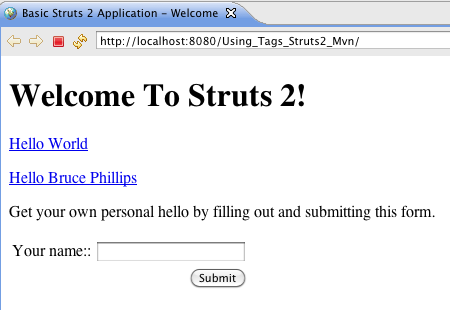

## Using Tags

This tutorial assumes you've completed the [Hello World](hello-world-using-struts2.html) tutorial and have a working helloworld project. The example code for this tutorial, using_tags, is available for checkout from the Struts 2 GitHub repository at [https://github.com/apache/struts-examples](https://github.com/apache/struts-examples). The example projects use Maven to manage the artifact dependencies and to build the .war files.

In the [Hello World](hello-world-using-struts2.html) lesson, we added to the index.jsp a Struts 2 url tag to create a hyperlink to the hello.action. This tutorial will explore the url and other Struts 2 tags further.

Web applications differ from conventional websites in that web applications can create a dynamic response. To make it easier to reference dynamic data from a page, the Struts 2 framework offers a set of tags. Some of the tags mimic standard HTML tag while providing added value. Other tags create non-standard, but useful controls.

To use the Struts 2 tags on the view page, you must include a tag library directive. Typically, the taglib directive is `<%@ taglib prefix="s" uri="/struts-tags" %\>`. So the prefix for all the Struts 2 tags will be "s". 
If you want to actually read the Struts 2 tag TLD file, you'll find it in the META-INF folder of the Struts 2 core jar.

__Struts 2 url Tag__

One use of the Struts 2 Tags is to create links to other web resources, especially to other resources in the local application.

While HTML provides a simple a tag for creating hyperlinks, the HTML tag often requires us to include redundant information. Also the HTML tag cannot easily access dynamic data provided by the framework.

A very common use case in web applications is linking to other pages. In the [Hello World](hello-world-using-struts2.html) tutorial we added to index.jsp a link to the hello.action using the Struts 2 url tag. Please refer to the _url documentation_  for more information about the url tag.

**index.jsp**

```html
<%@ page language="java" contentType="text/html; charset=ISO-8859-1" pageEncoding="ISO-8859-1"%>
<%@ taglib prefix="s" uri="/struts-tags" %>
<!DOCTYPE html PUBLIC "-//W3C//DTD HTML 4.01 Transitional//EN" "http://www.w3.org/TR/html4/loose.dtd">
<html>
  <head>
    <meta http-equiv="Content-Type" content="text/html; charset=ISO-8859-1">
    <title>Basic Struts 2 Application - Welcome</title>
  </head>
  <body>
    <h1>Welcome To Struts 2!</h1>
    <p><a href="<s:url action='hello'/>">Hello World</a></p>
  </body>
</html>
```

When you run the Hello World tutorial in your Servlet container and then mouse over the Hello World hyperlink created by the Struts 2 url tag you'll see that the URL created is hello.action (relative to the web context's root folder).

Examine the struts.xml configuration in the Hello World tutorial and you will find this:

**struts.xml**

```xml
...
<action name="hello" class="org.apache.struts.helloworld.action.HelloWorldAction" method="execute">
  <result name="success">/HelloWorld.jsp</result>
</action>
...
```

The action node above maps the hello.action to the execute method of class HelloWorldAction. If the execute method returns success, the view page HelloWorld.jsp (in web context root folder) will be returned to the user.

A common use case is that the URL also needs to include a value for a query string parameter such as userName. To add a query string parameter and its value use the Struts 2 param tag, nested inside the url tag.

For the Using Tags tutorial add the following to index.jsp just after the link for Hello World.

**url tag with param**

```xml
<s:url action="hello" var="helloLink">
  <s:param name="userName">Bruce Phillips</s:param>
</s:url>

<p><a href="${helloLink}">Hello Bruce Phillips</a></p>
```

Rather then put the url tag as the value for the anchor tag's href attribute, we've separated out the s:url tag into its own code block. Nested inside the url tag is the Struts 2 param tag. This tag lets you specify a parameter name (e.g. userName) and a value for that parameter (e.g. Bruce Phillips).

Notice the use of the var attribute. The value of the var attribute is a reference we can use later in our code to refer to the url created.

Examine the anchor tag above. Notice the value of the href attribute is `${helloLink\}`. The view page will substitute the hyperlink we created using the url tag for the `${helloLink\}` reference. Note that the query string parameter will be properly URL-encoded (`Bruce+Phillips`).

In the next tutorial we'll cover how Struts can access the query string parameter value.

__Struts 2 Form Tags__

Most applications will use several data entry forms. The Struts 2 tags make creating input forms easy. Consult the _Form Tags Reference_  for all the details about the Struts 2 form tags.

Each of the Struts 2 form tags has numerous attributes to mimic the normal HTML form tag attributes.

To create the outer shell of the form, use the Struts 2 form tag. The action attribute sets the action name to submit to.

Add the following markup to index.jsp after the Hello Bruce Phillips link.

**Struts 2 Form**

```html
<p>Get your own personal hello by filling out and submitting this form.</p>

<s:form action="hello">

  <s:textfield name="userName" label="Your name" />
	
  <s:submit value="Submit" />

</s:form>
```

The Struts 2 _textfield_  tag provides a input html tag of tag text and the submit tag creates a submit button. When the index page is return by the server to the browser you should see:



The Struts form, textfield, and submit tags were converted to this HTML.

**Struts Form Tags Converted To HTML**

```html
<form id="hello" name="hello" action="/Using_Tags_Struts2_Mvn/hello.action;jsessionid=3471d76027b5342cab44f297b567" method="post">

  <table class="wwFormTable">

    <tr>
      <td class="tdLabel"><label for="hello_userName" class="label">Your name:</label></td>
      <td><input type="text" name="userName" value="" id="hello_userName"/></td>
    </tr>

    <tr>
      <td colspan="2">
        <div align="right">
          <input type="submit" id="hello_0" value="Submit"/>
        </div>
      </td>
    </tr>

  </table>
</form>
```

Note how Struts 2 created a table inside the form to position the form elements. In later tutorials you'll learn how to specify the layout (table, CSS). The Struts 2 textfield tag created an HTML input tag of type text with a name value that matches the name value of the textfield tag. Struts 2 also created a label HTML tag based on the label value of the textfield tag.

In the next tutorial we'll cover how to use Struts 2 to process this form submission.

__Struts 2 property tag__

In the [Hello World](hello-world-using-struts2.html) tutorial's example application on JSP HelloWorld.jsp was this code:

**Struts Property Tag**

```html
<s:property value="messageStore.message" />
```

The most common use of the _property_  tag is used to "get" the value returned by calling a public get method (of the Action class) and then to include that value in the HTML returned to the browser.

As discussed in the [Hello World](#PAGE_14811871) tutorial, the value of "messageStore.message" instructs Struts 2 to first call method getMessageStore of the Action class. That method call returns a MessageStore object. The ".message" part instructs Struts 2 to call the getMessage method of the MessageStore object. The getMessage method returns a String which will be included in the HTML returned to the browser.

One very useful feature of the Struts 2 property tag is that it will automatically convert the most common data types (int, double, boolean) to their String equivalents. To demonstrate this feature let's add a static int variable to class HelloWorldAction.

**Add Static Field**

```java
private static int helloCount = 0;
	
public int getHelloCount() {
    return helloCount;
}

public void setHelloCount(int helloCount) {
    HelloWorldAction.helloCount = helloCount;
}
```

Each time the execute method is called we'll increase helloCount by 1. So add this code to the execute method of class HelloWorldAction.

**Increase helloCount**

```java
helloCount++;
```

Whenever a user clicks one of the links on page index.jsp (or submits the form), method execute of class HelloWorldAction will be run and the static field helloCount will be increased by one.

To include the value of the helloCount attribute in the HelloWorld.jsp we can use the Struts 2 property tag. Add the following to HelloWorld.jsp after the h2 tag.

**Use Property Tag To Display helloCount Value**

```html
<p>I've said hello <s:property value="helloCount" /> times!</p>
```

So even though the getHelloCount method returns an integer type, Struts 2 converted it to type String and placed it into the body of the p tag.

Note that even though helloCount is a static field, the get and set methods for helloCount are not static. For Struts 2 to call the getHelloCount method to get the value of helloCount, the getHelloCount method cannot be static.

If the value returned by the get method is an object, then the property tag will cause Struts 2 to call the object's toString method. Of course, you should always override Class Object's toString method in your model classes. Add the following toString method to the MessageStore class:

**Add toString Method To Class MessageStore**

```java
public String toString() {
    return message + " (from toString)";
}	
```

Add the following to HelloWorld.jsp

**Using Property Tag to Call toString**

```html
<p><s:property value="messageStore" /></p>
```

Since getMessageStore of HelloWorldAction class returns a MessageStore object, Struts 2 will call the toString method of class MessageStore. The string returned by that toString method will be displayed in the browser.


We covered a lot in this tutorial, but we've really only scratched the surface of how to use the Struts 2 tags. Consult the _Struts 2 Tag Reference_  for much more information about all the Struts 2 tags.

|Return to [Hello World using Struts 2](hello-world-using-struts2.html)|or|onward to [Coding Struts 2 Actions](coding-actions.html)|
